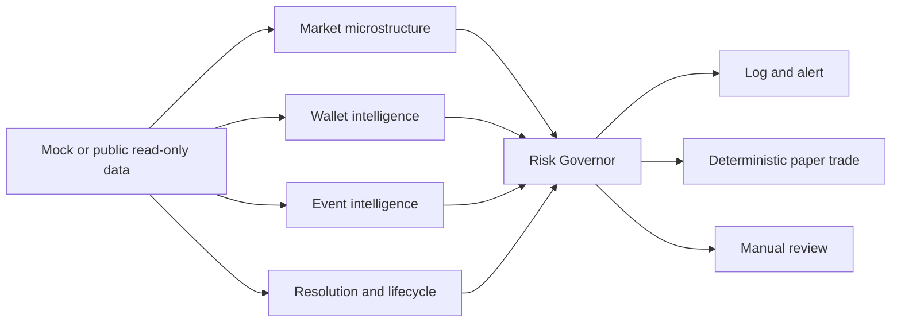

<div align="center">
  <h1>PolySignal Pro</h1>
  <p><strong>Research-first market intelligence and paper trading for Polymarket.</strong></p>
  <p>Observe public market data, explain candidate signals, and validate hypotheses under explicit risk controls.</p>
  <p>
    <a href="https://github.com/Zhiyunyang274/polysignal-pro/blob/main/LICENSE"></a>
    
    
    
  </p>
  <p><a href="README.md">English</a> | <a href="README.zh-CN.md">简体中文</a></p>
</div>

> Research software only. PolySignal Pro does not promise returns, does not place real orders by default, and does not treat paper results as evidence of profitability.

## What It Is

PolySignal Pro is a local system for studying Polymarket market structure. It combines public market data, several independent research engines, a central risk decision, and deterministic paper-trading records.

| Observe | Decide | Validate |
| --- | --- | --- |
| Read mock or public read-only market and orderbook data. | Reject unsafe or ambiguous signals before any action. | Record paper outcomes and research artifacts for later review. |

It is deliberately **not** an autonomous betting bot, a copy-trading product, a yield claim, or a high-frequency execution system.

## From Data To Review



The fast market-data path remains lightweight: it does not call an LLM or make slow external requests. LLM output is structured research input only; it cannot place an order.

## Key Capabilities

| Area | Included | Boundary |
| --- | --- | --- |
| Data ingestion | Mock, public Gamma/CLOB REST, and read-only WebSocket sources | Public data only; errors degrade safely instead of stopping the system. |
| Market structure | Spread, depth, orderbook imbalance, and YES/NO combined-price checks | A candidate signal is not a trade recommendation. |
| Intelligence | Wallet behavior, event assessment, resolution semantics, and lifecycle checks | Wallet and LLM signals are supporting inputs, never sole execution reasons. |
| Risk governance | Hard rejections, exposure limits, liquidity gates, stale-data checks, and circuit breakers | Hard rejections take priority over scores. |
| Research execution | Deterministic paper trader, SQLite records, CLI, Telegram alerts, dashboards, and a local web console | The live trader remains a stub. |
| Shadow validation | Run-scoped price, provenance, execution-cost, and forward-observation artifacts | Incomplete evidence fails closed and is not converted into PnL. |

## Quick Start

### 1. Install

```bash
git clone https://github.com/Zhiyunyang274/polysignal-pro.git
cd polysignal-pro

# Recommended: uv
uv sync --extra dev --extra dashboard

# Alternative: pip
python -m venv .venv
source .venv/bin/activate  # Windows: .venv\\Scripts\\activate
pip install -e ".[dev,dashboard]"
```

### 2. Create a local configuration

```bash
cp .env.example .env
```

The checked-in defaults are intentionally conservative:

```dotenv
DATA_MODE=mock
LIVE_TRADING_ENABLED=false
ALLOW_AUTO_EXECUTION=false
PAPER_TRADING_ENABLED=true
LLM_PROVIDER=mock
```

Do not commit `.env`. Public market research works without a private key.

### 3. Run the local pipeline

```bash
uv run polysignal
```

The default `mock` mode is the right place to verify your installation. Stop the long-running process with `Ctrl-C`.

## Explore The Console

Launch the compact local web console for the latest shadow-validation snapshot:

```bash
uv run python scripts/run_web_console.py --port 8502
```

Then open [http://127.0.0.1:8502](http://127.0.0.1:8502). The server binds to loopback by default and exposes no signing, ordering, cancellation, or mutation endpoint. It does not load `.env`, make network calls, or write research artifacts.

For the Streamlit research dashboard, run:

```bash
uv run python scripts/run_dashboard.py
```

## Choose A Data Mode

| Mode | Use It For | Behavior |
| --- | --- | --- |
| `mock` | Development, tests, and first run | Simulated data; the default. |
| `real_readonly` | Public API smoke tests and read-only research | Fetches public Polymarket data without an account, key, or order route. |
| `hybrid` | Resilient research experiments | Attempts public data and falls back to mock data on recoverable failures. |

Set `DATA_MODE` in `.env`. To exercise the public read-only clients explicitly:

```bash
uv run python scripts/smoke_real_readonly.py
```

That smoke test fetches public markets and orderbooks, runs the pipeline, and may create paper-trading records. It never submits a real order.

## Safety Model

The system is designed to stop before acting when its evidence is weak.

| Guardrail | Default behavior |
| --- | --- |
| Live execution | Disabled in [`config/risk.yaml`](config/risk.yaml). |
| Automatic execution | Disabled in [`config/risk.yaml`](config/risk.yaml). |
| Order path | The live trader is a non-executing stub. |
| Risk decision | Every candidate passes through the Risk Governor; hard rejections win. |
| LLM | Structured analysis only; never on the ultra-fast path and never an order source. |
| Ambiguous markets | Resolution or lifecycle ambiguity blocks live eligibility. |
| Secrets | Environment variables only; `.env` is ignored by Git. |
| Research evidence | Missing, stale, conflicting, or incomplete observations fail closed. |

Read the complete [risk policy](docs/risk_policy.md) before changing configuration or running public-data experiments.

## Current Research State

The crypto-threshold work is in **shadow validation**, not production trading. The current v7 cohort is collecting qualifying forward observations; it does not support a profitability claim, an edge claim, or a live-trading recommendation. Older artifacts are audit-only when their provenance or timing contract is insufficient.

The evidence, constraints, and next gates are documented in [GitHub Polymarket Strategy Research](docs/github_polymarket_strategy_research.md). This project keeps incomplete results visible rather than filling gaps with assumptions.

## Project Map

```text
polysignal/
  ingestion/     Public and mock market data clients
  engines/       Market, wallet, event, and lifecycle analysis
  strategies/    Candidate-signal rules
  risk/          Central risk controls and guards
  execution/     Deterministic paper trading and a live-trader stub
  shadow/        Run-scoped validation, provenance, and PnL research
  interface/     CLI, Telegram, dashboards, and local web console
  storage/       SQLite persistence

config/          Safe defaults and provider configuration
scripts/         Explicit research, validation, and reporting commands
tests/           Unit, integration, safety, and regression coverage
docs/            Architecture, operations, audit, and risk documentation
```

## Verify Locally

```bash
uv run pytest -q
```

The public-release verification completed with `1762 passed`. Tests use mocks or controlled fixtures and do not require a Polymarket account or private key.

## Documentation

| Document | Purpose |
| --- | --- |
| [Chinese README](README.zh-CN.md) | Full Simplified Chinese project guide. |
| [Specification](SPEC.md) | Product scope, architecture, and acceptance criteria. |
| [Engineering rules](CLAUDE.md) | Non-negotiable safety and implementation constraints. |
| [Risk policy](docs/risk_policy.md) | Risk gates, defaults, and operating boundaries. |
| [Architecture decisions](docs/architecture_decisions.md) | Recorded technical decisions and tradeoffs. |
| [API integration guide](docs/phase_4_api.md) | Public read-only Polymarket API usage. |
| [Package safety](docs/package_safety.md) | What is excluded from clean release packages. |

## Contributing

Contributions are welcome when they preserve the project's operating model:

1. Keep `live_trading_enabled` and `allow_auto_execution` disabled by default.
2. Do not add secrets, private keys, or authenticated order routes to examples or tests.
3. Route candidate decisions through the Risk Governor and add focused tests.
4. Treat missing or ambiguous market evidence as a reason to stop, not a reason to guess.

See [AGENTS.md](AGENTS.md) and [docs/coding_standard.md](docs/coding_standard.md) for repository conventions.

## License And Risk Notice

Released under the [MIT License](LICENSE). Prediction markets involve financial risk. Paper results, historical observations, and model scores do not predict future performance. Use this repository for research, verify every assumption independently, and never commit credentials.
