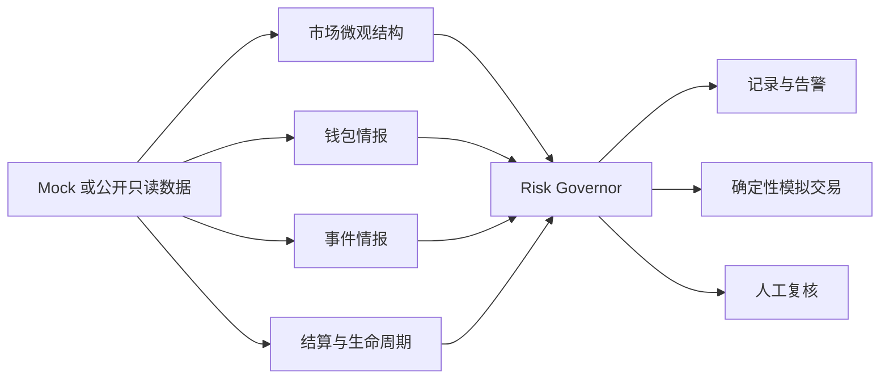

<div align="center">
  <h1>PolySignal Pro</h1>
  <p><strong>面向 Polymarket 的研究优先型市场情报与模拟交易系统。</strong></p>
  <p>观察公开市场数据，解释候选信号，并在明确的风控边界内验证研究假设。</p>
  <p>
    <a href="https://github.com/Zhiyunyang274/polysignal-pro/blob/main/LICENSE"></a>
    
    
    
  </p>
  <p><a href="README.md">English</a> | <a href="README.zh-CN.md">简体中文</a></p>
</div>

> 本项目仅用于研究。PolySignal Pro 不承诺收益，默认不提交真实订单，也不将模拟盘结果视作盈利能力的证据。

## 项目是什么

PolySignal Pro 在本地运行，组合公开市场数据、多个独立情报引擎、中央风控裁决与确定性模拟盘记录，帮助研究者审查 Polymarket 候选信号。

| 观察 | 裁决 | 验证 |
| --- | --- | --- |
| 读取 mock 或公开只读的市场与订单簿数据。 | 在任何动作前拒绝不安全或存在歧义的信号。 | 记录模拟结果与研究产物，供后续复盘。 |

它刻意**不是**自动下注机器人、跟单产品、收益承诺工具或高频执行系统。

## 从数据到可审查结论



快速市场数据路径保持轻量：不调用 LLM，也不执行慢速外部请求。LLM 的输出仅能作为结构化研究输入，不能产生订单。

## 核心能力

| 模块 | 已包含能力 | 明确边界 |
| --- | --- | --- |
| 数据接入 | Mock、公开 Gamma/CLOB REST 与只读 WebSocket 数据源 | 只读取公开数据；失败时安全降级。 |
| 市场结构 | 点差、深度、订单簿失衡与 YES/NO 合成价格检查 | 候选信号不等于交易建议。 |
| 情报引擎 | 钱包行为、事件评估、结算语义与生命周期检查 | 钱包和 LLM 只提供辅助分数，绝不是唯一交易理由。 |
| 风控中枢 | 硬拒绝、敞口限制、流动性门槛、陈旧数据检查与熔断 | 硬拒绝的优先级高于评分。 |
| 研究执行 | 确定性模拟盘、SQLite、CLI、Telegram 告警、仪表盘和本地 Web Console | 实盘执行器仍是不会下单的 stub。 |
| Shadow 验证 | 按 run 保存的价格、来源证明、执行成本与 forward observation 产物 | 证据不完整时 fail closed，不计算 PnL。 |

## 快速开始

### 1. 安装

```bash
git clone https://github.com/Zhiyunyang274/polysignal-pro.git
cd polysignal-pro

# 推荐使用 uv
uv sync --extra dev --extra dashboard

# 或使用 pip
python -m venv .venv
source .venv/bin/activate  # Windows: .venv\\Scripts\\activate
pip install -e ".[dev,dashboard]"
```

### 2. 创建本地配置

```bash
cp .env.example .env
```

仓库内的默认值保持保守：

```dotenv
DATA_MODE=mock
LIVE_TRADING_ENABLED=false
ALLOW_AUTO_EXECUTION=false
PAPER_TRADING_ENABLED=true
LLM_PROVIDER=mock
```

不要提交 `.env`。公开市场研究不需要私钥。

### 3. 运行本地流程

```bash
uv run polysignal
```

默认 `mock` 模式适合首次验证安装是否正确。该流程会持续运行，可用 `Ctrl-C` 停止。

## 使用本地控制台

启动紧凑的本地 Web Console，查看最新 shadow-validation 快照：

```bash
uv run python scripts/run_web_console.py --port 8502
```

打开 [http://127.0.0.1:8502](http://127.0.0.1:8502)。服务器默认只监听本机回环地址，没有签名、下单、撤单或任何修改数据的接口；它不读取 `.env`、不发起网络请求，也不写入研究产物。

如需启动 Streamlit 研究仪表盘：

```bash
uv run python scripts/run_dashboard.py
```

## 选择数据模式

| 模式 | 适合场景 | 行为 |
| --- | --- | --- |
| `mock` | 开发、测试与首次运行 | 使用模拟数据；默认模式。 |
| `real_readonly` | 公开 API 冒烟测试与只读研究 | 读取公开 Polymarket 数据，不需要账户、密钥或订单路径。 |
| `hybrid` | 需要韧性的研究实验 | 尝试公开数据；发生可恢复失败时降级到 mock。 |

在 `.env` 中设置 `DATA_MODE`。如需明确测试公开只读客户端：

```bash
uv run python scripts/smoke_real_readonly.py
```

该脚本读取公开市场和订单簿、运行完整流程，并可能产生模拟交易记录；它不会提交真实订单。

## 安全模型

系统在证据不足时应当停止，而不是猜测后继续。

| 护栏 | 默认行为 |
| --- | --- |
| 实盘执行 | 在 [`config/risk.yaml`](config/risk.yaml) 中默认关闭。 |
| 自动执行 | 在 [`config/risk.yaml`](config/risk.yaml) 中默认关闭。 |
| 订单路径 | Live Trader 是不会执行真实交易的 stub。 |
| 风控裁决 | 每个候选信号都必须经过 Risk Governor；硬拒绝优先。 |
| LLM | 仅做结构化分析；不进入 ultra-fast path，不能作为订单来源。 |
| 市场歧义 | 结算规则或生命周期存在歧义时，禁止获得实盘资格。 |
| 密钥 | 仅从环境变量读取；`.env` 已被 Git 忽略。 |
| 研究证据 | 缺失、陈旧、冲突或不完整的观察结果一律 fail closed。 |

修改配置或运行公开数据实验前，请阅读完整的[风控政策](docs/risk_policy.md)。

## 当前研究状态

Crypto threshold 方向仍处于 **shadow validation**，不是生产交易。当前 v7 cohort 正在收集合格的 forward observations，因此不支持盈利、优势或实盘建议的结论。来源证明或时间契约不充分的旧产物只用于审计。

证据、约束与下一步门槛记录在 [GitHub Polymarket 策略研究](docs/github_polymarket_strategy_research.md)。项目会保留不完整结果，而不会用假设填补空白。

## 项目结构

```text
polysignal/       采集、分析、策略、风控、模拟盘、shadow 验证与界面
config/           安全默认配置与 provider 配置
scripts/          显式的研究、验证与报告命令
tests/            单元、集成、安全与回归测试
docs/             架构、运维、审计与风控文档
```

## 本地验证

```bash
uv run pytest -q
```

公开发布前的完整验证结果为 `1762 passed`。测试使用 mock 或受控 fixtures，不需要 Polymarket 账户或私钥。

## 文档导航

| 文档 | 用途 |
| --- | --- |
| [English README](README.md) | 英文项目入口。 |
| [产品规格](SPEC.md) | 产品范围、架构与验收标准。 |
| [工程约束](CLAUDE.md) | 不可违反的安全与实现规则。 |
| [风控政策](docs/risk_policy.md) | 风控门槛、默认值与运行边界。 |
| [架构决策](docs/architecture_decisions.md) | 关键技术决策与取舍。 |
| [API 集成指南](docs/phase_4_api.md) | 公开只读 Polymarket API 的使用方式。 |
| [发布包安全说明](docs/package_safety.md) | 干净发布包明确排除的内容。 |

## 参与贡献

欢迎贡献，但必须保留项目的运行边界：

1. 默认保持 `live_trading_enabled` 与 `allow_auto_execution` 关闭。
2. 不在示例或测试中添加密钥、私钥或认证下单路径。
3. 候选决策必须经过 Risk Governor，并补充聚焦测试。
4. 面对缺失或歧义的市场证据，应停止而不是猜测。

仓库协作约定见 [AGENTS.md](AGENTS.md) 与 [编码规范](docs/coding_standard.md)。

## 许可证与风险提示

本项目采用 [MIT License](LICENSE)。预测市场存在金融风险；模拟结果、历史观察和模型评分都不能预测未来表现。请仅将本仓库用于研究，独立验证所有假设，并且绝不提交凭据。
